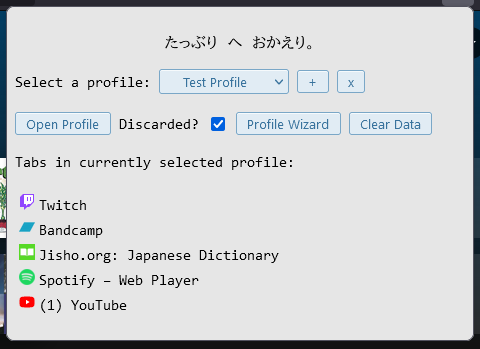

#  たっぶり

This is a work-in-progress web browser extension for managing tabs. Its planned features are

- [ ] sort tabs based on domain/search criteria
- [X] save and open individual browsing sessions
- [X] store tab, window, and browsing info locally
- [ ] identify similar and duplicate tabs
- [X] organize tab usage by unique windows that can be switched between
- [X] provide easy to use interfaces for sorting, deleting, and reorganizing tabs

## Install

On Firefox, you can install the extension by going to the AMO link [here.](https://addons.mozilla.org/en-US/firefox/addon/tabburi/) A Chrome version should hopefully be coming soon!

## Usage

tabburi's main use case is sorting tabs into collections called *profiles.* Imagine if your tabs were sheets of paper, and you could put each sheet of paper into a manila folder with other similar tabs, and then just open up the manila folder with those tabs whenever you wanted to have a specific browsing session. That's how tabburi works! Here's what it looks like:

When you start tabburi for the first time, it will establish a "default" profile, which contains all of the tabs in your current window. You can create new profiles by clicking the "+" next to the profile selector, and delete them by clicking on the "x".

To construct your profiles, click on the "Profile Wizard" button. This will open up a new menu that will contain all the tabs in the default profile on the left. Choose a profile to edit from the dropdown menu at the top, and then select any tabs you want to add to that profile by clicking on their checkbox. Then, click the submit button, and they will be removed from your default profile and added to whatever profile you have selected.

To switch profiles, open up the extension, select the profile you want to switch to, and click the "Open Profile" button. tabburi will open up a new window with all of the tabs in the profile you selected, and close out the other window.

tabburi automatically keeps track of any tabs you add, remove, or edit while the window is open, so there's no need to worry about saving the profile. Tabs are added and removed from the currently active profile, which is displayed below the profile selector. When you open a profile using the "Open Profile" button, it is switched to being the currently active profile.

By default, tabburi will open all tabs in the selected profile as "discarded", which means that the tab exists, but the webpage within it hasn't been loaded yet, so it takes up a lot less memory. This is to allow users with profiles that contain many tabs to switch between them without a large memory overhead. If you'd like to open the tabs normally, just deselect this option before opening your profile. tabburi will remember your selection for the next time you open the extension. **Note that this functionality is only available in the Firefox version; Chrome does not (yet) allow for creating tabs as "discarded", and so it is impossible to implement on their platform as of writing.**

## Background

The extension's name is a play on the word たっぷり (*tappuri*) from Japanese, which means "in ample supply". Because my tabs are always in ample supply, no matter what browser I happen to be using, I thought this was an apt name for an extension to help manage them.
